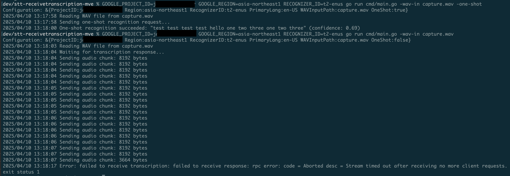

# Speech-to-Text v2 StreamingRecognize MVE

This is a Minimal Verifiable Example (MVE) demonstrating an issue with the StreamingRecognize functionality in the Google Cloud Speech-to-Text v2 Go client library.

Specifically, when using the `SreamingRecognize API`, `speechpb.Speech_StreamingRecognizeClient.Recv()` blocks indefinitely and never returns any transcriptions.

This MVE also includes a sample one shot `Recognize API` call to verify that the Recognizer exists and works as expected.

## Steps to reproduce

Prerequisites:

- Google Cloud Project with Speech-to-Text API enabled
- A recognizer created in your Google Cloud Project
- A WAV audio file for testing

Then run:

```bash
$ export GOOGLE_PROJECT_ID="your-project-id"
$ export GOOGLE_REGION="your-region"  # Optional, defaults to "global"
$ export RECOGNIZER_ID="your-recognizer-id"

# Exercises StreamingRecognize
$ go run cmd/main.go -wav-in capture.wav -primary en-US

# Exercises Recognize
$ go run cmd/main.go -wav-in capture.wav -primary en-US -one-shot
```


## Expected vs Actual Behavior

Expected: Speech client returns a steady stream of transcriptions based on streamed audio.

Actual: Speech client `Recv()` call hangs indefinitely until the stream times out from inactivity.

Sample project run:




## Additional Notes

- The program uses the "latest_long" model for transcription
- Audio is processed in chunks of 8192 bytes
- Streaming mode includes a 200ms delay between chunks to simulate real-time streaming 